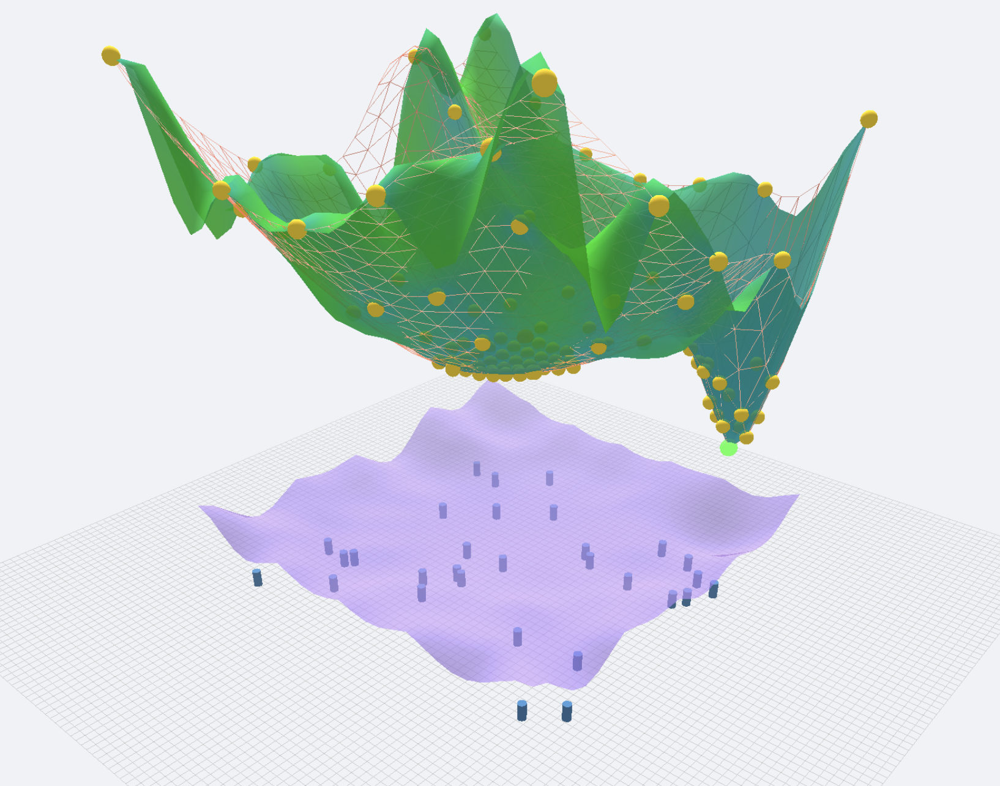
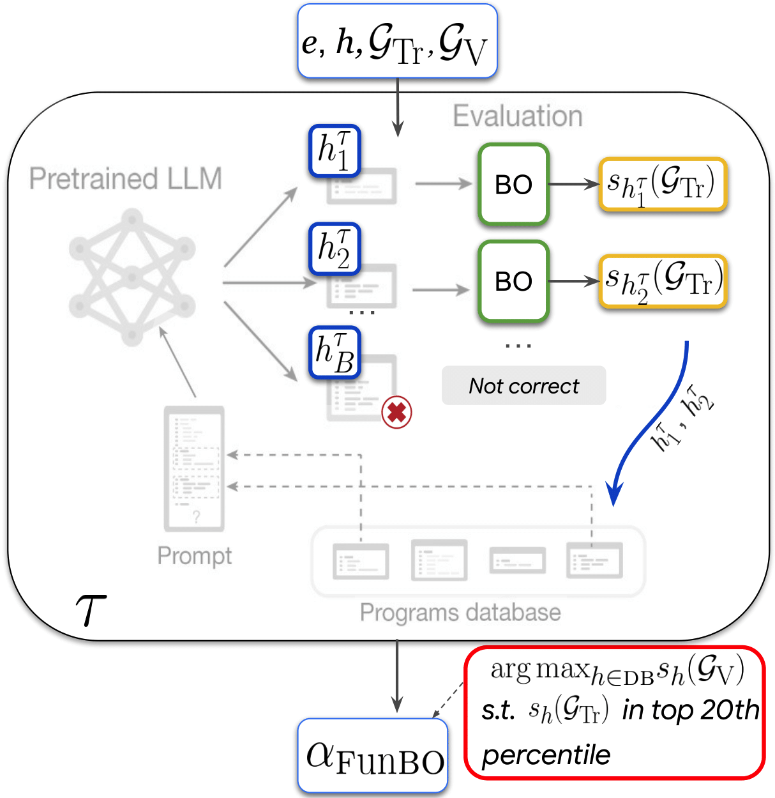

title: "🎯 Slimmer Beslissen in Logistiek" subtitle: "Een Introductie tot Bayesian Optimization" author: "Witek ten Hove" format: revealjs: theme: white slide-number: true transition: slide background-transition: fade incremental: false width: 1600 height: 900 margin: 0.1 min-scale: 0.2 max-scale: 1.5 center: true html-math-method: katex embed-resources: true jupyter: python3 execute: freeze: auto cache: false
Welkom {.center}
Voor wie: De logistieke professional die vooruit wil.

Investering: 30 minuten van uw tijd.

Resultaat: Een interactieve ervaring die uw kijk op optimalisatie verandert.

<strong>Welkom bij de volgende stap in optimalisatie.</strong>

🎯 Wat Neemt u Mee?
Na dit halfuur bent u in staat om:

<h3>🎯 Kansen Identificeren</h3>

De kostbare 'trial-and-error'-processen in uw organisatie te herkennen en de kansen voor een slimmere aanpak te zien.

<h3>🚀 Sneller Resultaat</h3>

De kracht te doorgronden van een methode die sneller tot betere resultaten leidt, met significant minder experimenten.

<h3>🗣️ De Juiste Vragen Stellen</h3>

Een helder, strategisch gesprek te voeren met uw data scientists over de kernprincipes van Bayesian Optimization.

<h3>⚖️ Strategisch Afwegen</h3>

De cruciale balans te begrijpen tussen het verkennen van nieuwe mogelijkheden en het benutten van bewezen successen.

::: {.center}
Straks duiken we in de praktijk met interactieve demo's. Maak u klaar om zelf te ontdekken.
:::

📋 De Route van Vandaag

🎯

<strong>De Kern van de Uitdaging</strong> 
<small>2 minuten</small>

→

🧠

<strong>Een Strategisch Antwoord</strong> 
<small>7 minuten</small>

→

🔄

<strong>Het Leerproces in de Praktijk</strong> 
<small>4 minuten</small>

→

🚛

<strong>De Impact op uw Resultaat</strong> 
<small>2 minuten</small>

::: {.center style="background: linear-gradient(135deg, #667eea 0%, #764ba2 100%); color: white; padding: 30px; border-radius: 15px; margin-top: 30px;"}

🤖 De Hamvraag in de Logistiek
Hoe vinden we de optimale oplossing,

zonder een fortuin uit te geven aan experimenten?

:::

🎯 De Uitdaging: Kostbare 'Black Box'-Problemen

<h2 style="color: #dc3545;">🔲 Wat is een 'Black Box'?</h2>

<strong>Stelt u zich voor:</strong> nieuwe software voor routeplanning.

<ul>
<li>U voert parameters in (capaciteit, levertijden)</li>
<li>De software presenteert een efficiëntiescore</li>
<li>De complexe logica áchter die score blijft verborgen</li>
<li><strong>Het enige wat telt: INPUT → OUTPUT</strong></li>
</ul>

<h2 style="color: #fd7e14;">💰 Waarom is Experimenteren zo Kostbaar?</h2>

Iedere test vraagt een investering in:

<ul>
<li><strong>Tijd:</strong> Weken voor een pilot, maanden voor een project</li>
<li><strong>Geld:</strong> Brandstof, manuren, operationele verstoring</li>
<li><strong>Middelen:</strong> Voertuigen, personeel, rekenkracht</li>
</ul>

❌ Duizenden scenario's testen is simpelweg onmogelijk.

⚡ Het Dilemma

<h2>⚡ Het Dilemma</h2>

U streeft naar het ultieme resultaat, maar weet dat u nooit alle opties kunt testen. 
Puur gokwerk is inefficiënt. <strong>Het is tijd voor een doorbraak: een slimmere strategie.</strong>

<strong>En die strategie? Die heet Bayesian Optimization. Laten we ontdekken hoe het werkt. →</strong>

🧠 Een Strategisch Antwoord: Bayesian Optimization

<h2 style="margin-top: 0;">🎭 De Twee Pilaren van een Zelflerend Systeem</h2>

Vergelijk het met een expert die met elk experiment scherpere inzichten krijgt.

<h3 style="color: #3c763d; margin-top: 0;">🔮 De Intelligente Voorspeller</h3>

<strong>(Surrogaatmodel)</strong>

Leert van eerdere resultaten en bouwt een aanname op over het totale speelveld.

Net als een ervaren manager die feilloos aanvoelt welke routes potentie hebben.

⟷

<h3 style="color: #31708f; margin-top: 0;">🎯 De Strategische Beslisser</h3>

<strong>(Acquisitiefunctie)</strong>

Bepaalt welke volgende test de meest waardevolle informatie oplevert.

Vindt de balans tussen het verkennen van onbekend terrein en het perfectioneren van wat al goed presteert.

🎯 Van Onzekerheid naar Inzicht: Het Model in Actie

<h2 style="margin: 0; font-size: 1.5em;">De Leerreis van Onzekerheid naar Zekerheid</h2>

Observeer hoe de 'Intelligente Voorspeller' met elk nieuw datapunt aan zekerheid wint.

#| echo: false
#| output: true
#| label: fig-gp-progression
#| fig-width: 11
#| fig-height: 8
#| fig-align: center
import numpy as np
import plotly.graph_objects as go
from plotly.subplots import make_subplots
from sklearn.gaussian_process import GaussianProcessRegressor
from sklearn.gaussian_process.kernels import RBF, ConstantKernel as C
from scipy.stats import norm

def black_box_function(x):
    """The true function we're trying to optimize"""
    return np.sin(0.9 * x) * np.sinc(x * 0.2) * 50 + 25

# Setup
x_range = np.linspace(0, 20, 200).reshape(-1, 1)
y_true = black_box_function(x_range)

# Define sampling points for each iteration
initial_points = np.array([[2.0], [18.0]])
additional_points = [
    np.array([[10.0]]),
    np.array([[5.0]]),
    np.array([[14.0]]),
    np.array([[7.5], [12.0]]),
]

# Create subplots
fig = make_subplots(
    rows=2, cols=2,
    subplot_titles=(
        '<b>Stap 1: Eerste Verkenning (2 observaties)</b>',
        '<b>Stap 2: Vroeg Leerproces (3 observaties)</b>',
        '<b>Stap 3: Verfijnde Inschatting (5 observaties)</b>',
        '<b>Stap 4: Gekalibreerd Model (7 observaties)</b>'
    ),
    horizontal_spacing=0.10,
    vertical_spacing=0.12
)

# Kernel for GP
kernel = C(1.0, (1e-3, 1e3)) * RBF(10, (1e-2, 1e2))

# Track sample points
X_samples = initial_points.copy()
y_samples = black_box_function(X_samples)

# Define iterations for each subplot
iterations = [0, 1, 3, 5]
subplot_positions = [(1, 1), (1, 2), (2, 1), (2, 2)]

for idx, (n_iter, pos) in enumerate(zip(iterations, subplot_positions)):
    row, col = pos
    
    if idx > 0:
        for i in range(iterations[idx-1], n_iter):
            if i < len(additional_points):
                X_samples = np.vstack([X_samples, additional_points[i]])
                y_samples = black_box_function(X_samples)
    
    gp = GaussianProcessRegressor(kernel=kernel, n_restarts_optimizer=9, random_state=0, alpha=1e-6)
    gp.fit(X_samples, y_samples)
    y_pred, sigma = gp.predict(x_range, return_std=True)
    
    fig.add_trace(go.Scatter(x=x_range.ravel(), y=y_true.ravel(), mode='lines', name='Ware Functie', line=dict(color='#e74c3c', dash='dash', width=2), visible='legendonly', showlegend=(idx == 0), legendgroup='true'), row=row, col=col)
    fig.add_trace(go.Scatter(x=x_range.ravel(), y=y_pred, mode='lines', name='Modelvoorspelling', line=dict(color='#2ecc71', width=2), showlegend=(idx == 0), legendgroup='mean'), row=row, col=col)
    fig.add_trace(go.Scatter(x=np.concatenate([x_range.ravel(), x_range.ravel()[::-1]]), y=np.concatenate([y_pred + 1.96*sigma, (y_pred - 1.96*sigma)[::-1]]), fill='toself', fillcolor='rgba(46,204,113,0.15)', line=dict(color='rgba(255,255,255,0)'), name='95% Betrouwbaarheid', showlegend=(idx == 0), legendgroup='ci'), row=row, col=col)
    fig.add_trace(go.Scatter(x=X_samples.ravel(), y=y_samples.ravel(), mode='markers', name='Observaties', marker=dict(color='#3498db', size=10, symbol='circle', line=dict(width=2, color='white')), showlegend=(idx == 0), legendgroup='samples'), row=row, col=col)
    
    avg_uncertainty = np.mean(sigma)
    fig.add_annotation(text=f'<b>Gem. Onzekerheid: {avg_uncertainty:.2f}</b>', xref=f'x{idx+1}', yref=f'y{idx+1}', x=17.5, y=72, showarrow=False, font=dict(size=11, color='#2c3e50', family='Arial, sans-serif'), bgcolor='rgba(255,255,255,0.95)', bordercolor='rgba(44,62,80,0.3)', borderwidth=1, borderpad=5)

fig.update_layout(title={'text': '<b>De Leerreis van het Model: Van Onzekerheid naar Zekerheid</b>', 'x': 0.5, 'font': {'size': 20, 'family': 'Arial, sans-serif'}}, height=750, width=1400, showlegend=True, legend=dict(orientation="v", yanchor="top", y=0.98, xanchor="right", x=0.98, font=dict(size=11), bgcolor='rgba(255,255,255,0.9)', bordercolor='rgba(0,0,0,0.1)', borderwidth=1), plot_bgcolor='rgba(250,250,250,1)', paper_bgcolor='white', font=dict(size=11, family='Arial, sans-serif'), margin=dict(l=60, r=40, t=80, b=80))

for i in range(1, 5):
    fig.update_xaxes(title_text='Input Parameter' if i > 2 else '', title_font=dict(size=13), tickfont=dict(size=11), gridcolor='rgba(128,128,128,0.15)', showgrid=True, row=(i-1)//2 + 1, col=(i-1)%2 + 1)
    fig.update_yaxes(title_text='Resultaat' if i % 2 == 1 else '', title_font=dict(size=13), tickfont=dict(size=11), gridcolor='rgba(128,128,128,0.15)', showgrid=True, row=(i-1)//2 + 1, col=(i-1)%2 + 1)

fig.show()

🎯 De Strategische Afweging: Exploiteren vs. Verkennen

<h2 style="margin: 0; font-size: 1.2em;">Waar Testen we Volgend?</h2>

De 'Strategische Beslisser' kiest zorgvuldig: gaan we voor het perfectioneren van een bekend succes, of verkleinen we onze 'blinde vlekken'?

#| echo: false
#| output: true
#| label: fig-acquisition-final
#| fig-width: 12
#| fig-height: 8.5
#| fig-align: center
import numpy as np
import plotly.graph_objects as go
from plotly.subplots import make_subplots
from scipy.stats import norm
from sklearn.gaussian_process import GaussianProcessRegressor
from sklearn.gaussian_process.kernels import RBF, ConstantKernel as C

def black_box_function(x):
    return np.sin(0.9 * x) * np.sinc(x * 0.2) * 50 + 25
x_range = np.linspace(0, 20, 200).reshape(-1, 1)
y_true = black_box_function(x_range)
kernel = C(1.0, (1e-3, 1e3)) * RBF(10, (1e-2, 1e2))
X_final = np.array([[2.0], [18.0], [10.0], [5.0], [14.0], [7.5], [12.0]])
y_final = black_box_function(X_final)
gp_final = GaussianProcessRegressor(kernel=kernel, n_restarts_optimizer=9, random_state=0, alpha=1e-6)
gp_final.fit(X_final, y_final)
y_pred_final, sigma_final = gp_final.predict(x_range, return_std=True)
mu_sample_opt = np.max(y_final)
with np.errstate(divide='ignore', invalid='ignore'):
    imp = y_pred_final.ravel() - mu_sample_opt
    Z = imp / sigma_final
    ei = imp * norm.cdf(Z) + sigma_final * norm.pdf(Z)
    ei[sigma_final == 0.0] = 0.0

fig_acq = make_subplots(rows=2, cols=1, shared_xaxes=True, vertical_spacing=0.08, row_heights=[0.6, 0.4])

fig_acq.add_trace(go.Scatter(x=x_range.ravel(), y=y_true.ravel(), mode='lines', name='Ware Functie', line=dict(color='#e74c3c', dash='dash')), row=1, col=1)
fig_acq.add_trace(go.Scatter(x=x_range.ravel(), y=y_pred_final, mode='lines', name='Modelvoorspelling', line=dict(color='#2ecc71')), row=1, col=1)
fig_acq.add_trace(go.Scatter(x=np.concatenate([x_range.ravel(), x_range.ravel()[::-1]]), y=np.concatenate([y_pred_final + 1.96*sigma_final, (y_pred_final - 1.96*sigma_final)[::-1]]), fill='toself', fillcolor='rgba(46,204,113,0.15)', line=dict(color='rgba(255,255,255,0)'), name='95% Betrouwbaarheid'), row=1, col=1)
fig_acq.add_trace(go.Scatter(x=X_final.ravel(), y=y_final.ravel(), mode='markers', name='Observaties', marker=dict(color='#3498db', size=10, line=dict(width=2, color='white'))), row=1, col=1)
best_next_x = x_range[np.argmax(ei)]
fig_acq.add_trace(go.Scatter(x=x_range.ravel(), y=ei, mode='lines', name='Acquisitiefunctie', line=dict(color='#8e44ad', width=3), fill='tozeroy', fillcolor='rgba(142, 68, 173, 0.1)'), row=2, col=1)
fig_acq.add_vline(x=best_next_x, line_width=3, line_dash="dash", line_color="#f39c12", row=2, col=1, annotation_text="<b>Volgende Test!</b>", annotation_position="top", annotation_font_size=12)

exploit_peak_idx = np.argmax(ei[:100])
explore_peak_idx = 100 + np.argmax(ei[100:])
exploit_x = x_range[exploit_peak_idx][0]
explore_x = x_range[explore_peak_idx][0]

fig_acq.add_annotation(text="<b>EXPLOITEREN</b> Grote kans op hoog rendement", x=exploit_x, y=ei[exploit_peak_idx]*0.9, arrowhead=2, ax=0, ay=-35, font_size=11, row=2, col=1, bgcolor="rgba(255,255,255,0.8)")
fig_acq.add_annotation(text="<b>VERKENNEN</b> Gebied met grote onzekerheid", x=explore_x, y=ei[explore_peak_idx]*0.9, arrowhead=2, ax=0, ay=-35, font_size=11, row=2, col=1, bgcolor="rgba(255,255,255,0.8)")

fig_acq.update_layout(title={'text': "<b>De Strategische Keuze: Waar Testen We Volgend?</b>", 'x':0.5, 'y':0.98, 'font_size': 18}, height=750, legend=dict(x=0.99, y=0.98, xanchor='right', yanchor='top', bgcolor='rgba(255,255,255,0.7)', bordercolor='lightgrey', borderwidth=1, font_size=11), plot_bgcolor='rgba(250,250,250,1)', margin=dict(l=60, r=20, t=50, b=80))

fig_acq.update_yaxes(title_text='Resultaat', title_font_size=12, tickfont_size=10, row=1, col=1)
fig_acq.update_yaxes(title_text='Verwachte Verbetering', title_font_size=12, tickfont_size=10, row=2, col=1)
fig_acq.update_xaxes(title_text='Input Parameter', title_font_size=12, tickfont_size=10, row=2, col=1)

fig_acq.show()

🔄 Het Cyclische Proces naar de Optimale Oplossing

<h2 style="margin: 0; font-size: 1.4em;">Vijf Stappen naar een Steeds Slimmere Keuze</h2>

1

<h4 style="margin: 5px 0; font-size: 1.05em;">Initialiseer</h4>

Start met enkele verkennende metingen

→

2

<h4 style="margin: 5px 0; font-size: 1.05em;">Modelleer</h4>

Het model vormt een beeld van de werkelijkheid

→

3

<h4 style="margin: 5px 0; font-size: 1.05em;">Selecteer</h4>

De 'beslisser' wijst de meest informatieve test aan

→

4

<h4 style="margin: 5px 0; font-size: 1.05em;">Valideer</h4>

Voer het kostbare, fysieke experiment uit

→

5

<h4 style="margin: 5px 0; font-size: 1.05em;">Optimaliseer</h4>

Voeg het resultaat toe en herhaal de cyclus

::: {style="background: #f8f9fa; padding: 25px; border-radius: 12px; border-left: 5px solid #007bff; margin-top: 180px;"}

💡 De Kern
Het algoritme balanceert continu. Eerst het speelveld in kaart brengen (verkennen), daarna gericht de 'goudaders' aanboren (exploiteren). Dit is de sleutel tot een efficiëntie die willekeurig testen ver overtreft.
:::

🏭 De Praktijk: De Optimale DC Locatie Vinden

<strong>De Case:</strong> Bepaal de ideale DC-locatie, met een budget voor slechts enkele kostbare haalbaarheidsstudies.

<a href="bo-simulator-fast.html" target="_blank" style="display: inline-block; background: linear-gradient(135deg, #00b894 0%, #00cec9 100%); color: white; text-decoration: none; padding: 10px 20px; border-radius: 6px; font-size: 0.95em; font-weight: bold; box-shadow: 0 3px 12px rgba(0, 184, 148, 0.3);">
🚀 Start de Simulator
</a>
 Opent in een nieuw venster

<h3 style="color: #00529b; margin: 0 0 10px 0; font-size: 1em;">🔍 Wat u gaat zien:</h3>

● <strong>Blauwe cilinders:</strong> Uw klantlocaties

● <strong>Gekleurd oppervlak:</strong> De kostenvoorspelling van de AI

● <strong>Rood raster:</strong> De (verborgen) realiteit

● <strong>Paars oppervlak:</strong> Waar de AI vervolgens wil testen

<h3 style="color: #00529b; margin: 0 0 10px 0; font-size: 1em;">⚡ Experimenteer zelf:</h3>

• Start de simulatie met <strong>'Initialize/Reset'</strong> 
• Voer het leerproces stap voor stap uit 
• Pas de 'Exploration'-schuif aan 
• Wissel tussen voorspelling en realiteit 
• Ontdek hoe de AI het optimum vindt!

<strong>💡 Cruciaal Inzicht:</strong> U ziet live hoe het algoritme de strategische balans vindt tussen het verkennen van onbekend terrein en het benutten van veelbelovende locaties. Dát is de kern van efficiënt optimaliseren.

🚛 Uw Strategische Voorsprong in de Logistiek

<h2 style="margin-top: 0;">Minder Experimenten, Meer Resultaat</h2>

De formule voor efficiëntie, kostenbesparing en een versnelde innovatie.

🤖

<h3 style="color: #e53e3e; font-size: 1.1em; margin: 0 0 8px 0;">Perfectie in Voorspelling</h3>

Vind de optimale parameters voor uw demand forecasting- en ETA-modellen.

🚚

<h3 style="color: #38a169; font-size: 1.1em; margin: 0 0 8px 0;">Efficiëntie op de Weg</h3>

Kalibreer uw route-algoritmes voor minimale brandstofkosten en maximale punctualiteit.

🏭

<h3 style="color: #dd6b20; font-size: 1.1em; margin: 0 0 8px 0;">Slimme Magazijnen</h3>

Optimaliseer de configuratie van uw robotica en sorteerstrategieën via snelle, effectieve simulaties.

⛓️

<h3 style="color: #3182ce; font-size: 1.1em; margin: 0 0 8px 0;">Netwerkontwerp van de Toekomst</h3>

Identificeer de ideale DC-locaties, gebaseerd op een perfecte balans tussen kosten en serviceniveau.

📦 De Kern van de Zaak
::: {.center style="background: linear-gradient(135deg, #667eea 0%, #764ba2 100%); color: white; padding: 30px; border-radius: 15px;"}
In een wereld waar elk experiment telt,

is slim optimaliseren geen luxe meer. Het is een strategische noodzaak om uw concurrentiepositie te versterken.

:::

🚀 De Volgende Stap: AI die Zelf Strategieën Ontwikkelt

<h2 style="margin: 0; font-size: 1.2em;">Een Revolutie in Optimalisatie</h2>

We staan aan de vooravond van AI die zelf compleet nieuwe optimalisatietechnieken ontwerpt.

<h3 style="color: #6c5ce7; margin-bottom: 15px; font-size: 1.1em;">🤖 Voorbeeld: FunBO, waar AI zijn Eigen Strategieën Bouwt</h3>

🧠

<strong>Generatie:</strong> Een Large Language Model genereert code voor nieuwe beslisstrategieën.

🧪

<strong>Evaluatie:</strong> Een geautomatiseerd systeem test de effectiviteit van elke nieuwe strategie.

🏆

<strong>Evolutie:</strong> Alleen de best presterende strategieën worden behouden en doorontwikkeld.

<h4 style="color: #2c5aa0; margin: 0 0 5px 0; font-size: 0.95em;">💡 De Impact voor U</h4>

Dit leidt tot op maat gemaakte optimalisatiestrategieën, die de standaardmethodes ver achter zich laten.

<em>Bron:</em> Aglietti et al. (2024). Funbo: Discovering acquisition functions for bayesian optimization with funsearch. <em>arXiv:2406.04824</em>.

<strong>Het FunBO-proces:</strong> AI genereert, test en evolueert continu om tot superieure oplossingen te komen.

🎯 De Essentie & Uw Volgende Stappen

<h1 style="margin-top: 0;">🧠 De Formule voor Slim Optimaliseren</h1>

Bayesian Optimization = De Kracht van een Slimme Voorspeller + een Strategische Beslisser

<h2 style="color: #2d3436; font-size: 1.3em;">🎉 Uw Belangrijkste Inzichten</h2>

<ul style="font-size: 0.85em; line-height: 1.5; margin: 0; padding-left: 15px;">
<li>Een krachtige strategie gebaseerd op <strong>voorspellen en beslissen</strong>.</li>
<li><strong>Maximale inzichten</strong> met een minimaal aantal dure tests.</li>
<li>De cruciale, strategische balans tussen <strong>verkennen en exploiteren</strong>.</li>
<li>Directe impact op <strong>kosten, efficiëntie en innovatiekracht</strong>.</li>
</ul>

<h2 style="color: #2d3436; font-size: 1.3em;">🚀 Uw Concrete Volgende Stappen</h2>

<ol style="font-size: 0.85em; line-height: 1.5; margin: 0; padding-left: 15px;">
<li><strong>Identificeer:</strong> Waar in uw proces zitten de kostbare 'trial-and-error'-cycli?</li>
<li><strong>Activeer:</strong> Ga het gesprek aan met uw data- en R&D-teams.</li>
<li><strong>Experimenteer:</strong> Start een pilot met één afgebakend, complex probleem.</li>
<li><strong>Valideer:</strong> Meet de resultaten en bouw de business case.</li>
</ol>

🎤 Vragen & Discussie
::: {style="background: #f8f9fa; padding: 30px; border-radius: 15px; border: 2px solid #28a745;"}
🎤

Bent u er klaar voor om te ontdekken waar Bayesian Optimization uw logistieke operatie kan versterken?

Laten we de discussie openen en uw specifieke uitdagingen en kansen verkennen.

:::

🙏 Hartelijk Dank {.center}
::: {.center style="padding: 40px; background: linear-gradient(135deg, #74b9ff 0%, #0984e3 100%); color: white; border-radius: 15px;"}
Contactgegevens HAN Lectoraat Logistiek en Allianties | Karen.Engelvaart@han.nl

Deze presentatie bevat interactieve demo's over Bayesian Optimization
:::